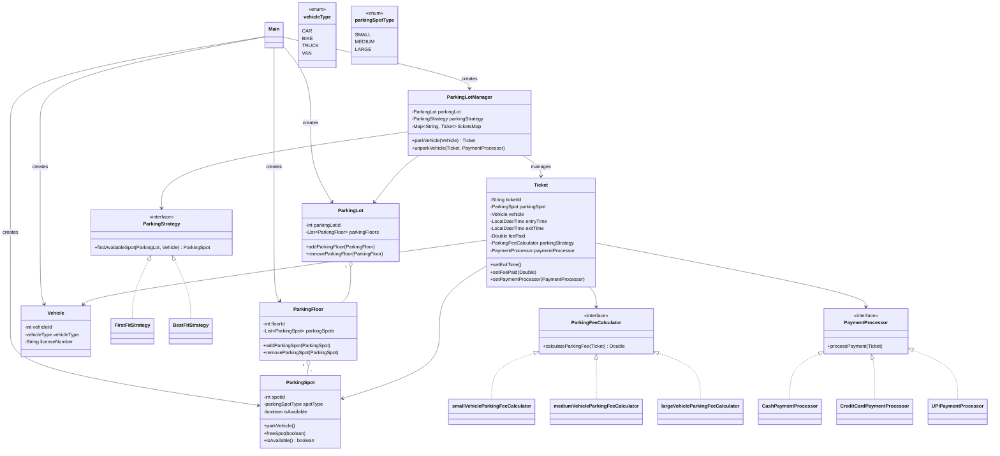

# Parking Lot LLD Example

This module implements a basic parking lot system using strategy patterns for:
- parking spot selection (`ParkingStrategy`)
- fee calculation (`ParkingFeeCalculator`)
- payment processing (`PaymentProcessor`)

All entities are currently implemented as `static` nested classes inside `Main`.

## UML Class Diagram



## Entities and Responsibilities

- `ParkingLot`: top-level container for all parking floors.
- `ParkingFloor`: holds a collection of `ParkingSpot` objects.
- `ParkingSpot`: represents one physical spot with type and availability.
- `Vehicle`: holds vehicle identity and size category.
- `Ticket`: lifecycle object created on park; stores entry/exit timestamps, fee strategy, selected payment processor, and final fee.
- `ParkingLotManager`: orchestrates park/unpark operations and ticket map.

## Strategy Interfaces

- `ParkingStrategy`: decides which spot to allocate.
  - `FirstFitStrategy`: returns first matching available spot.
  - `BestFitStrategy`: returns smallest possible available spot that fits the vehicle.

- `ParkingFeeCalculator`: computes fee from ticket data.
  - `smallVehicleParkingFeeCalculator`
  - `mediumVehicleParkingFeeCalculator`
  - `largeVehicleParkingFeeCalculator`

- `PaymentProcessor`: processes payment before final unpark.
  - `CashPaymentProcessor`
  - `CreditCardPaymentProcessor`
  - `UPIPaymentProcessor`

## Enums

- `vehicleType`: includes size metadata used for spot fit checks.
- `parkingSpotType`: includes size metadata used for spot allocation and fee basis.

## Runtime Flow

1. `ParkingLotManager.parkVehicle(vehicle)`:
   - finds an available spot using `ParkingStrategy`
   - marks spot occupied
   - creates and stores a `Ticket` with the selected `ParkingFeeCalculator`

2. `ParkingLotManager.unparkVehicle(ticket, paymentProcessor)`:
   - sets ticket exit time
   - sets and executes payment processor
   - calculates and stores fee
   - prints ticket details
   - frees spot and removes ticket from active map

## How to Run

From this directory:

```bash
javac Main.java
java Main
```
